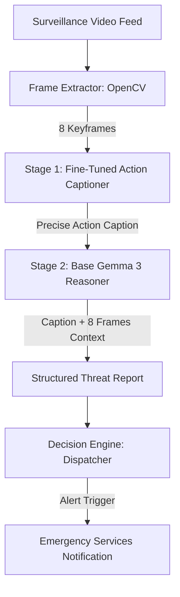

# System Architecture - DRDO Surveillance Threat Assessment

This document provides a detailed overview of the system architecture, data flow, and components of the VLM-Based Video Threat Detection and Assessment System.

---

## 1. System Overview

The system is designed to perform offline and real-time automated monitoring of surveillance camera feeds (CCTV) to detect threats and trigger emergency response dispatches. It combines a fine-tuned Vision-Language Model (Gemma 3 4B IT) with a **Two-Stage Hybrid Inference Pipeline** to resolve the issue of "instruction collapse" (where fine-tuned VLMs lose their formatting/reasoning abilities).



---

## 2. Core Components

### A. Frame Extractor (OpenCV)
*   **Module:** `backend/frame_extractor.py`
*   **Role:** Extracts exactly 8 representative, evenly-spaced keyframes from raw video segments (`.mp4`, `.avi`, `.mov`).
*   **Robustness:** Uses OpenCV capture contexts, handling corrupted videos or unreadable frames gracefully by skipping positions.

### B. Stage 1: Fine-Tuned Action Captioner (LoRA Adapter)
*   **Module:** `backend/hf_gemma_analyzer.py` / `models/model_loader.py`
*   **Model:** Gemma 3 4B IT + `surveillance_colab` adapter.
*   **Role:** Identifies the precise physical action happening in the 8-frame sequence.
*   **Outputs:** A single sentence description (e.g., *"Multiple individuals are physically fighting, punching, and wrestling."*).

### C. Stage 2: Base VLM Reasoning Engine
*   **Module:** `frontend/app.py` / `evaluation/run_eval_xd.py`
*   **Model:** Gemma 3 4B IT (Unadapted Base).
*   **Role:** Takes the Stage 1 predicted action and the 8 frames as context. It generates a detailed structured reasoning report while preserving full formatting capabilities.

### D. Decision Engine (Gradio UI / Alert Pipeline)
*   **Module:** `frontend/app.py` / `backend/realtime_alert_pipeline.py`
*   **Role:** Parses the threat level (Low, Medium, High) and triggers simulated emergency dispatches based on semantic keywords (e.g., dispatching fire services if "arson" or "explosion" is detected).

---

## 3. Data Flow

1.  **Ingestion:** User uploads a video or raw CCTV feed.
2.  **Keyframe Sampling:** 8 frames are extracted and loaded into Pillow `Image` objects.
3.  **Chat Template Application:** The VLM processor structures the images and text prompts into conversation format:
    ```python
    messages = [
        {"role": "user", "content": [
            {"type": "image", "image": img1},
            # ... up to 8 images ...
            {"type": "text", "text": prompt}
        ]}
    ]
    ```
4.  **Stage 1 Inference:** Extracts caption using fine-tuned LoRA weights.
5.  **Stage 2 Inference:** Combines caption with reasoning prompt to generate report.
6.  **Export:** Saves reports in CSV, Markdown, and JSON formats under `outputs/`.
